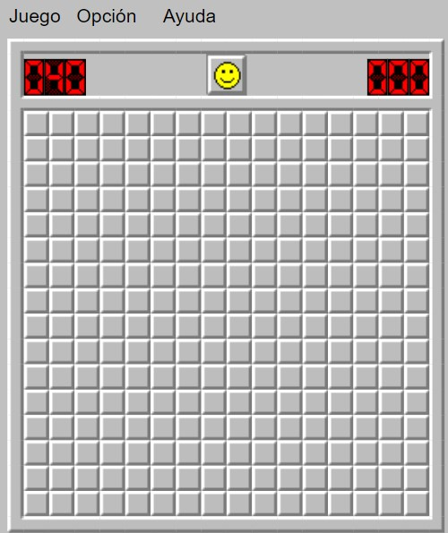

# Aplicación Buscaminas

Enlace del vídeo explicativo del juego: 
(https://youtu.be/3cf_5OPJA_o)


Este es un proyecto del grupo L5-5:
- Ángela Bernal Martín
- Andrés Francisco García Rivero
- Mercedes Iglesias Martín
- Paola Martín Sánchez
- Pablo Quindós de la Riva
- Santiago Zuleta de Reales Toro


## Descripción del juego

El objetivo en este proyecto consiste en diseñar e implementar un sistema y sus pruebas
asociadas al juego del Buscaminas, el cual es muy intuitivo y fácil de aprender a jugar.

El Buscaminas es un juego de un solo jugador, cuyo objetivo es despejar todas las casillas de
un tablero que no oculten una mina, e ir marcando con banderas aquellas en las que se crea
que puede contener una mina.

Algunas casillas tienen un número, este número indica las minas que hay en todas las casillas
circundantes. Así, si una casilla tiene el número 3, significa que de las ocho casillas que hay
alrededor (si no es en una esquina o borde) hay 3 con minas y 5 sin minas. Si se descubre
una casilla sin número indica que ninguna de las casillas vecinas tiene mina y estas se
descubren automáticamente.

Se puede poner una marca en las casillas (normalmente indicada con un icono de una
bandera roja) donde el jugador piensa que hay minas para ayudar a descubrir las que están
cerca.

La partida termina cuando se descubre una casilla con una mina que quiere decir que el
jugador ha perdido la partida, o bien, cuando éste despeja todas las casillas que no tengan
minas, ganando así la partida. Por tanto, la duración del juego depende de cuánto tiempo
emplee el jugador en ganar o perder, es decir, no hay un tiempo límite.

Por último, indicar que el tiempo (expresado en segundos) es un parámetro muy
importante, ya que si un jugador ha ganado dos partidas con el mismo nivel de dificultad,
será mejor resultado aquella partida ganada en menos tiempo.


## Ejecutar Buscaminas localmente
Petclinic es una aplicación Spring Boot creada con Maven. Puede crear un archivo jar y ejecutarlo desde la línea de comandos:


```
git clone https://github.com/gii-is-DP1/dp1-2022-2023-l5-5.git
cd dp1-2022-2023-l5-5
./mvnw package
java -jar target/*.jar
```

Puedes acceder al buscaminas aquí: http://localhost:8080/



O puede ejecutarlo directamente desde Maven usando el complemento Spring Boot Maven. Si hace esto, recogerá los cambios que realice en el proyecto de inmediato (los cambios en los archivos fuente de Java también requieren una compilación; la mayoría de las personas usan un IDE para esto):

```
./mvnw spring-boot:run
```

